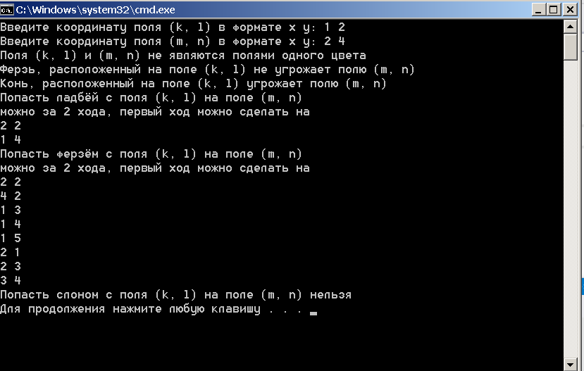

# chess
Программа анализирует ходы шахматных фигур по указанным координатам на поле
-

-
Программа создана в среде разработки Microsoft Visual Studio 2015.
-
Чтобы открыть код программы и запустить его из среды разработки,
необходимо открыть файл "chess/chess.sln" через Microsoft Visual Studio 2015.
Запуск программы осуществляется комбинацией клавишь "Ctr + f5".
-
Можно запустить программу напрямую открыв файл "chess/Release/chess.exe".
-
